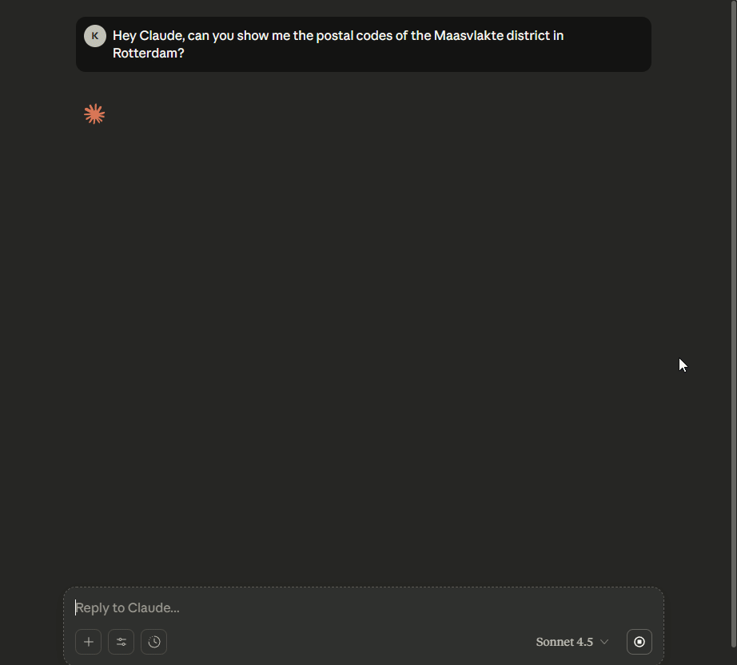

# GISBlox MCP Server  

A **C# implementation of the Model Context Protocol (MCP)** for seamless integration with **GISBlox APIs**.  

### Unlock the Power of Geospatial Intelligence  
The GISBlox MCP Server enables your AI applications to tap into advanced geospatial capabilities with minimal setup. By bridging MCP with GISBlox, you can:  

- Retrieve **Dutch postal code data** for marketing, logistics, and analysis  
- Generate quick **visualizations and insights** from postal code datasets  
- Convert **Well‑Known Text (WKT)** and **Well‑Known Binary (WKB)** into **GeoJSON**, and vice-versa
- **Project** and transform geospatial data across coordinate systems with ease  
- Get access to **usage data** and insights of tracked interactive maps 

### Why Use This Server?  
- **AI‑ready**: Designed for MCP, making it easy to connect geospatial intelligence to your AI workflows  
- **Scalable**: Built on .NET for performance and reliability in production environments  
- **Practical**: Focused on real‑world use cases like marketing campaigns, geo‑analytics, and data visualization  

### Demo

## 🗝️ Usage

A personal service key from GISBlox is required to use the MCP server. 

To generate a service key:

1. Sign up for a GISBlox account at [gisblox.com/signup](https://account.gisblox.com/registreren)
2. Navigate to your [Subscriptions Dashboard](https://account.gisblox.com/profiel/abonnementen)
3. Click the `Add` button and select the **free** subscription to the **GISBlox Location Services** in the dropdown.
4. Once subscribed, click the **Location Services** tile and copy the service key from the information panel.

## 📖 Integration guides

Refer to the following guides for setting up the MCP server in your preferred environment:

- [Debug in Visual Studio](docs/vstudio-setup.md) - Step-by-step guide to set up the MCP server for debugging in Visual Studio.
- Refer to the [Hosted MCP Server setup guide](docs/hosted-mcp-guide.md) if you plan on using the hosted MCP server.

    - [VS Code](docs/hosted-mcp-guide.md#21-vs-code) - Instructions for integrating with Visual Studio Code
    - [Visual Studio](docs/hosted-mcp-guide.md#22-visual-studio) - Step-by-step guide to use the MCP server in Visual Studio
    - [Claude Desktop](docs/hosted-mcp-guide.md#23-claude-desktop) - Instructions for integrating with Claude Desktop

## ✨ Example Prompts

Try these prompts after setting up the MCP server:

### Conversion
- "Convert this WKT geometry string into a GeoJson feature collection"

### Map Analytics
- "List the maps that are tracked by Map Analytics"
- "Which map has the highest engagement numbers in the last 2 weeks?"
- "Show the map KPIs of map XYZ"

### Postal Code Data
- "List the Dutch gemeenten and sort them alphabetically"
- "Give me some key demographics for postal code 3811"
- "Which postal codes are neighbours of postal code 3068?"
- "Visualize the postal code areas for 1012, 1013, and 1014 in Amsterdam on a map"

### Projection
- "Reproject this RDPoint (85530, 446100) to a WGS84 coordinate"

👉 Also available is our [GISBlox MCP Prompt Pack](https://github.com/GISBlox/mcp-prompt-pack) with reusable prompts for various use cases.

## 🛠️ Tools

GISBlox API Tools available via the MCP server:

### Conversion tool

Converts GeoJson into WKB and WKT geometry objects, and vice versa, using the [GISBlox Conversion API](https://services.gisblox.com/index.html#operations-tag-Conversion).

### Map Analytics tool

Provides access to map analytics data using the [GISBlox Map Analytics API](https://services.gisblox.com/index.html#operations-tag-Map_Analytics). Features include:
- List tracked maps
- Get map KPIs for all maps, or a specific map
- Retrieve engagement metrics

### Postal Code Data tool

Provides access to Dutch postal code data, including demographics, neighborhoods, and more using the [GISBlox Postal Codes API](https://services.gisblox.com/index.html#operations-tag-Dutch_Postal_Codes_-_4_digits). Features include:
- Retrieve postal code details
- List neighboring postal codes
- Get demographic information for a specific postal code
- Retrieve postal code records for Dutch municipalities (gemeenten), neighborhoods (wijken) and districts (buurten)
- Query postal codes based on a WKT geometry string, with optional buffer distance

### Projection tool

Transforms geospatial data between coordinate systems using the [GISBlox Projection API](https://services.gisblox.com/index.html#operations-tag-Projection). Supported transformations include:
- RDNew (EPSG:28992) to WGS84 (EPSG:4326)
- WGS84 (EPSG:4326) to RDNew (EPSG:28992)
- Batch operations are supported for efficiency

### Visualization tool

Generates visual representations of geospatial data. Capabilities include:
- Generate a geojson.io URL to quickly visualize the geometry of postal codes
- Create maps with multiple postal codes for neighborhood analysis
- Calls [ZipChat Copilot](https://zipchat.gisblox.com/) to generate maps, code snippets, retrieve postal codes for addresses, and more

## 🆘 Getting Support

- [Ask questions, share ideas](https://github.com/GISBlox/mcp-server/discussions)
- [Create an issue](https://github.com/GISBlox/mcp-server/issues)

## 📚 Additional Resources

- [GISBlox Services SDK](https://github.com/GISBlox/gisblox-services-sdk)
- [Model Context Protocol Specification](https://modelcontextprotocol.io)
- [Company website](https://www.bartelsonline.nl/)