# Hosted MCP Server User Guide

The GISBlox hosted MCP server provides direct access to all GISBlox geospatial tools without requiring local installation or setup.

## 1. Endpoint

**Production endpoint**: `https://mcp.gisblox.com/mcp`

**Protocol support**: Currently supports Streamable HTTP transport.


## 2. Client Setup Instructions

Each MCP client has its own configuration process for the hosted MCP server. Below are instructions for the most used clients:

- [VS Code](#21-vs-code)
- [Visual Studio](#22-visual-studio)
- [Claude Desktop](#23-claude-desktop)

### 2.1 VS Code

1. Enable MCP in VS Code ([refer to VS Code MCP documentation](https://code.visualstudio.com/docs/copilot/customization/mcp-servers)).
2. Create a `.vscode/mcp.json` configuration file in your workspace. Use the following configuration:

  ```json
    {
      "servers": {
        "gisblox-mcp": {
          "type": "http",
          "url": "https://mcp.gisblox.com/mcp",
          "headers": {
             "Authorization": "Bearer <YOUR_KEY>"
          }
        }
      }
    }
  ```

Refer to the [README](../README.md#%EF%B8%8F-usage) for more information on obtaining a service key.

3. Save the configuration.
4. Start the MCP service in VS Code if needed:

   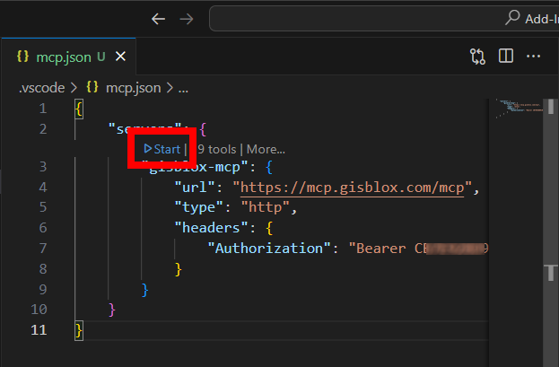

5. Click the Trust button to enable the MCP server:

   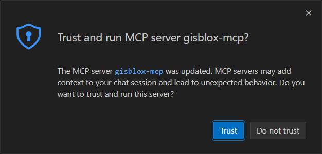

6. Confirm the server is running by checking the status in the MCP panel:

   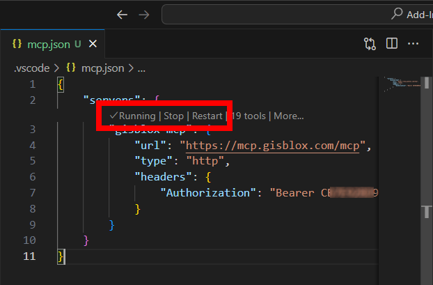

7. Open a new chat window, set the chat mode to "Agent", and select the tools you want to use by click the "Tools" icon:

   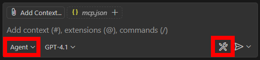

   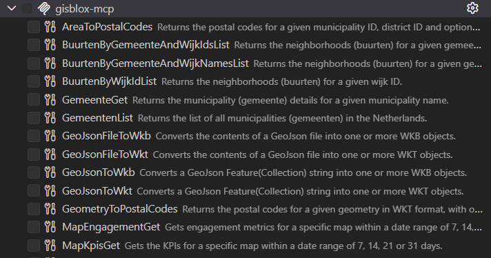

8. Test the setup with a prompt like: `Give me some key demographics for postal code 3811`.

9. When prompted, allow Copilot to use the tools provided by the MCP server:
 
   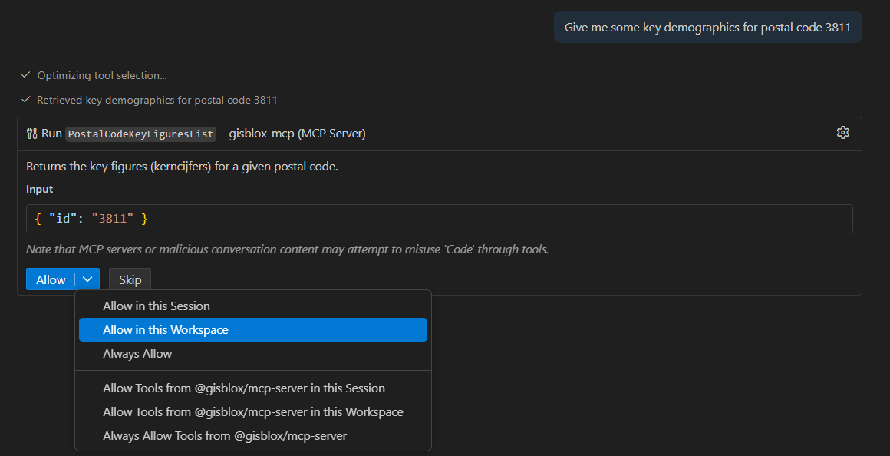

### 2.2 Visual Studio

1. Ensure you have Visual Studio 2022 (17.14.9 or later) installed and configured with Copilot.

2. Open the GitHub Copilot Chat window and click on the "Select tools" icon:
 
   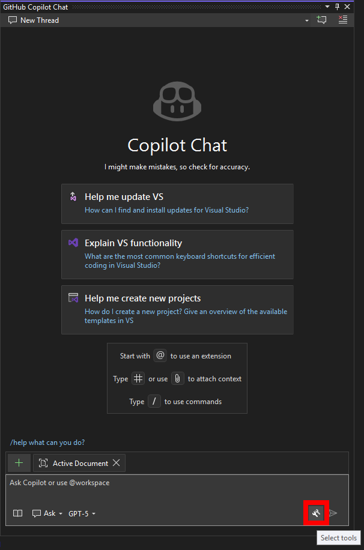

3. In the "Select tools" dialog, click on "Add new MCP server":

   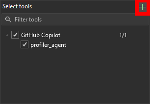

4. Fill in the MCP server details:

   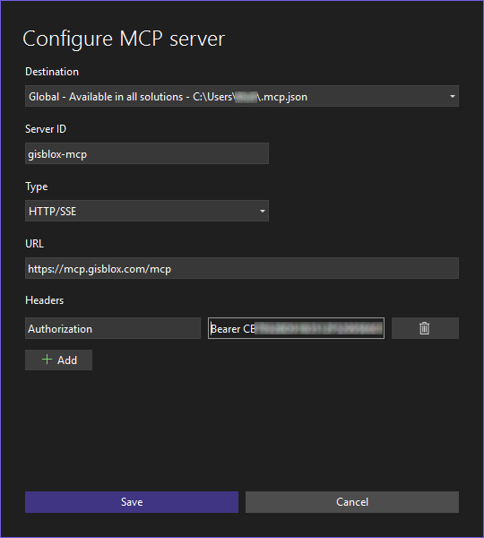

5. Click "Save" to add the server.

6. Choose the tools you want to use by clicking the "Tools" icon:

   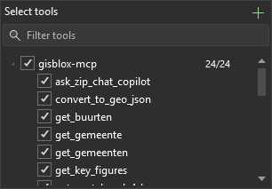

7. Change the chat mode to "Agent" and test the setup with a prompt like: `Give me some key demographics for postal code 3811`.

8. When prompted, allow Copilot to use the tools provided by the MCP server:
 
   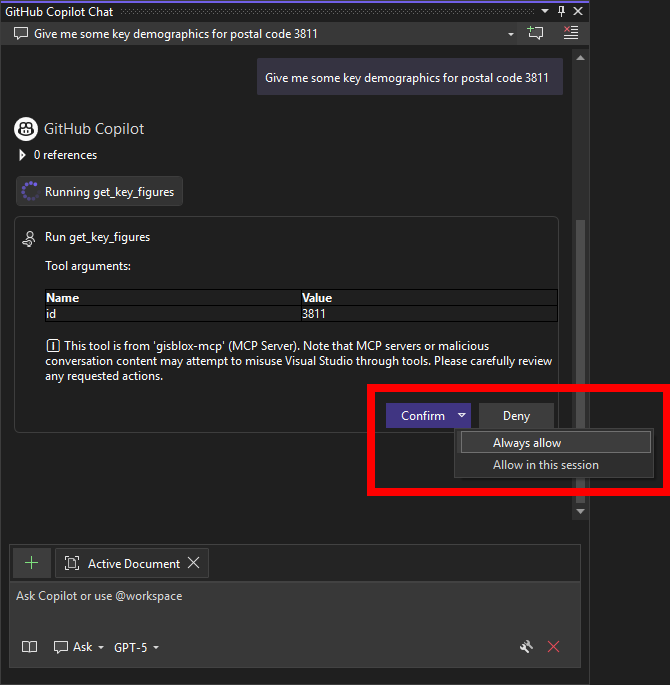


### 2.3 Claude Desktop

1. Install Claude Desktop 
 
   [Download](https://claude.ai/download) and install the Claude Desktop application from the official page.

2. Open Claude Desktop and navigate to the settings by clicking the hamburger icon in the top left corner.

    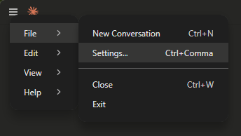

3. In the settings menu, select "Developer", and click `Edit Config`.
 
    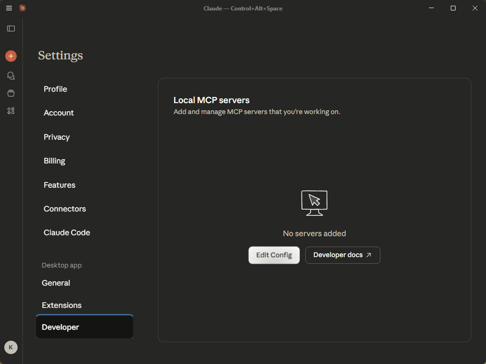 

4. Open the `claude_desktop_config.json` file and add the following configuration settings to the file:

   > **Note**: Claude Desktop currently requires [`mcp-remote`](https://github.com/geelen/mcp-remote) as middleware to connect to hosted endpoints. 

   ```json
   {
      "mcpServers": {
        "gisblox-mcp": {
          "command": "npx",
          "args": [
              "mcp-remote",
              "https://mcp.gisblox.com/mcp",
              "--header",
              "Authorization:${AUTH_HEADER}"
          ],
          "env": {
              "AUTH_HEADER": "Bearer <YOUR_KEY>"
          }
      }
   }
   ```

5. Save the configuration and restart Claude Desktop.

6. Go to the Settings menu again and verify that the MCP server is listed under "Local MCP servers". Clicking the `Advanced options` button should show the authentication details with your service key:
 
    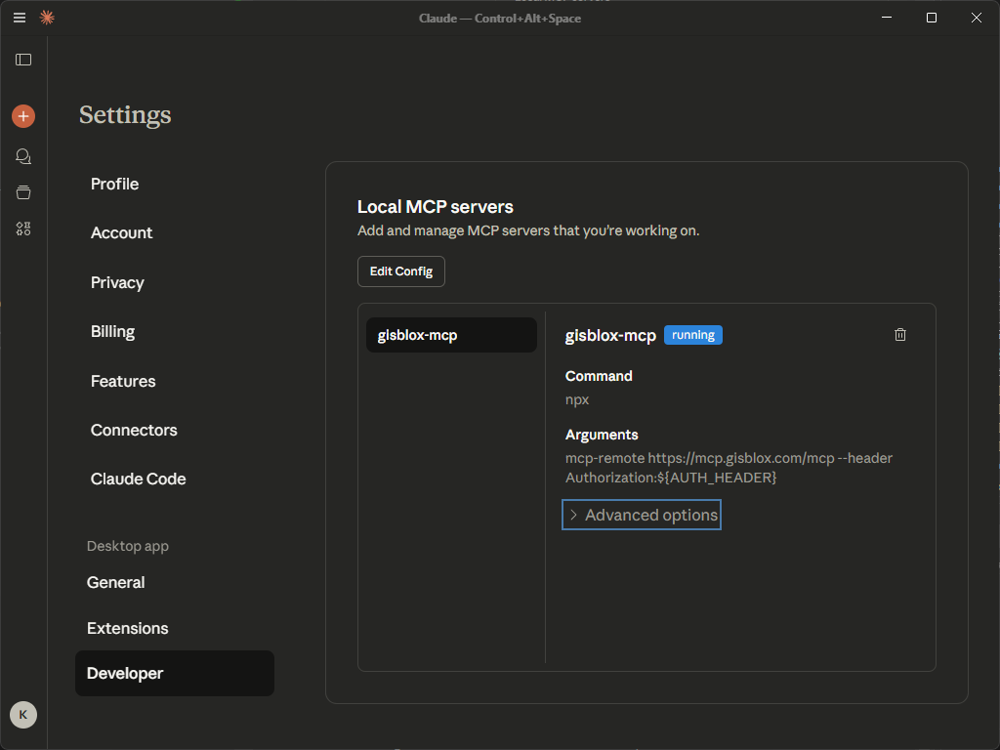

7. Start a new chat, and verify that the `gisblox-mcp` server is enabled in the "Search and tools" dropdown.

    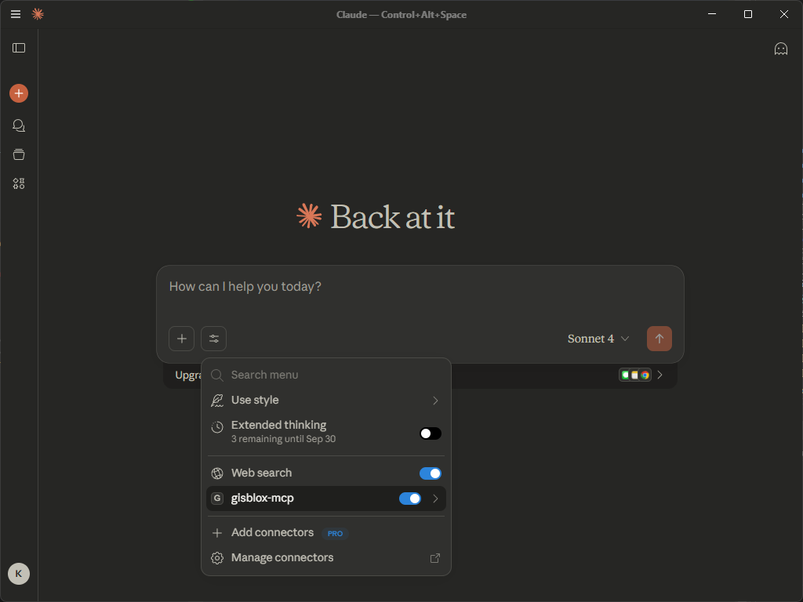

8. Click on the `gisblox-mcp` item in the dropdown. You should see the tools provided by the MCP server listed in the tools section:

    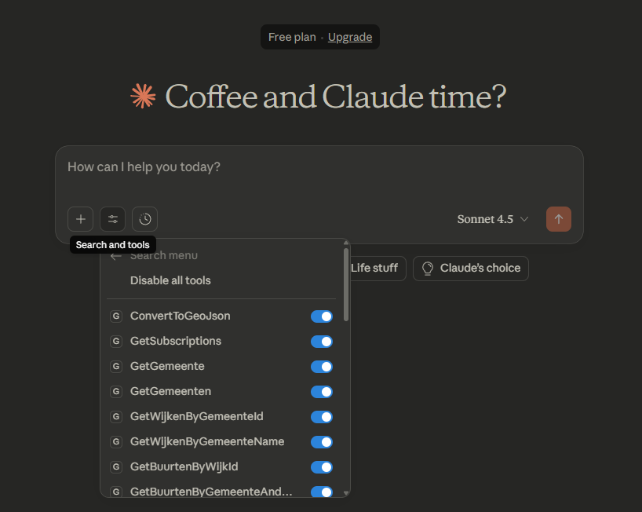

9. Test the setup with a prompt like: `Give me some key demographics for postal code 3811`.

10. When prompted, allow Claude to use the tools provided by the MCP server:
 
   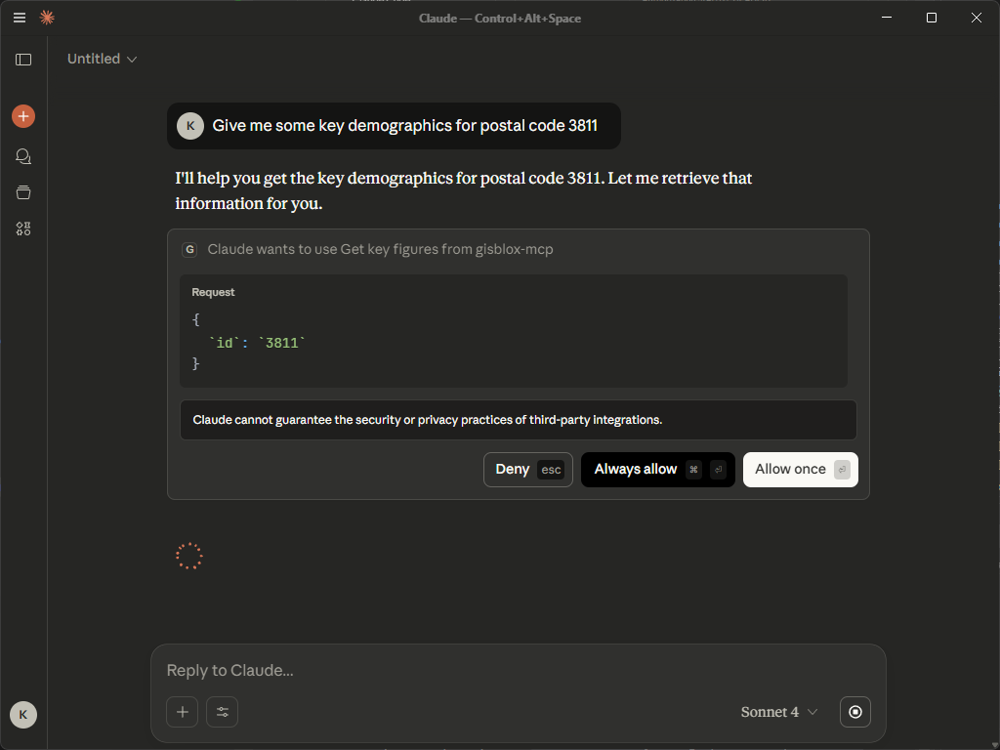

## 3. Direct API Access

For programmatic integration, you can call the hosted MCP server directly using your GISBlox service key. This is ideal for backend scripts, testing, and automation.

### 3.1 Prerequisites

- Valid [GISBlox Service Key](../README.md#%EF%B8%8F-usage)
- HTTP client (curl, Node.js fetch, Python requests, Bruno, Postman, etc.)

### 3.2 Protocol

The server uses JSON-RPC 2.0 protocol with these required fields:

- `jsonrpc`: "2.0"
- `method`: The operation to perform
- `params`: Operation parameters
- `id`: Request identifier (a number or a string)

**Endpoint**: `https://mcp.gisblox.com/mcp`

### 3.3 Available Operations

#### List Available Tools

Retrieve all supported tools and their schemas:

```bash
curl --request POST \
  --url https://mcp.gisblox.com/mcp \
  --header 'content-type: application/json' \
  --data '{
    "method": "tools/list",
    "params": {},
    "jsonrpc": "2.0",
    "id": 1
  }'
```

**Example Response (simplified)**

```json
{
  "jsonrpc": "2.0",
  "id": 1,
  "result": {
    "tools": [
      {
        "name": "WktToGeoJson",
        "description": "Converts a WKT geometry string into a GeoJson Feature(Collection) string.",
        "inputSchema": {          
          "properties": {
            "wkt": {
              "type": "string"
            },
            "asFeatureCollection": {
              "type": "boolean"
            }
          }          
        }
      },
      {
        "name": "GeoJsonToWkt",
        "description": "Converts a GeoJson Feature(Collection) string into one or more WKT objects.",
        "inputSchema": {          
          "properties": {
            "geoJson": {
              "type": "string"
            }
          }          
        }
      }
    ]
  }
}
```

#### Execute a Tool

Call a specific tool with parameters:

```bash
curl --request POST \
  --url https://mcp.gisblox.com/mcp \
  --header 'authorization: Bearer <YOUR_KEY>' \
  --header 'content-type: application/json' \
  --data '{
    "method": "tool/invoke",
    "params": {
        "name": "WijkenByGemeenteIdList",
        "arguments": {
        "gemeenteId": 308
        }
    },
    "jsonrpc": "2.0",
    "id": 3
 }'
```

**Example Response**

```json
{
  "jsonrpc": "2.0",
  "id": 3,
  "result": {
    "content": [
      {
        "type": "text",
        "text": "{\"MetaData\":{\"GWBType\":\"Wijken\",\"ParentID\":308,\"TotalRecords\":5},\"RecordSet\":[{\"ID\":30800,\"Naam\":\"Wijk 00 Baarn\"},{\"ID\":30801,\"Naam\":\"Wijk 01 Baarn-Noord, Eemdal en Eemland\"},{\"ID\":30802,\"Naam\":\"Wijk 02 P.H.W.park\"},{\"ID\":30804,\"Naam\":\"Wijk 04 Buitengebied\"},{\"ID\":30805,\"Naam\":\"Wijk 05 Lage Vuursche\"}]}"
      }
    ],
    "isError": false
  }
}
```