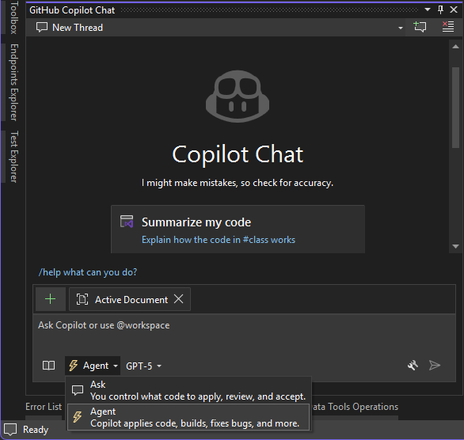
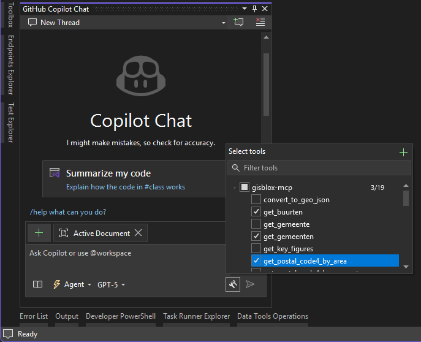
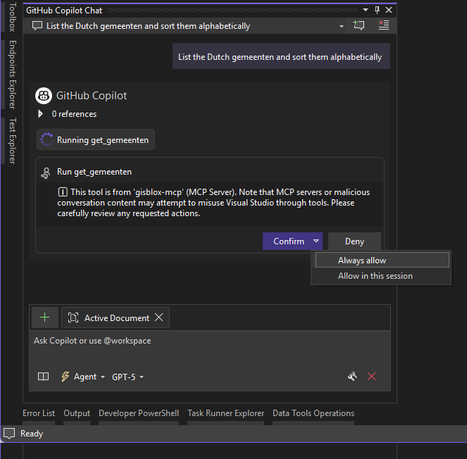
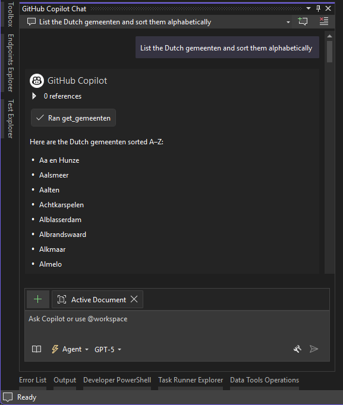

# Visual Studio Setup

This guide explains how to configure Visual Studio for use with the GISBlox MCP Server.

Refer to the [Hosted MCP Server setup guide](hosted-mcp-setup.md) if you do not want to install or configure anything locally.

## Requirements

- Visual Studio 2022 (17.14.9 or later) installed and configured with Copilot
- GISBlox MCP Server built locally

## Setup Instructions

1. Go to the `.mcp.json` file in the `Solution Items` folder.

2. Either add your service key to the `GISBLOX_SERVICE_KEY` property in the `env` section of the file, or add it as a system environment variable. 
   
   Refer to the [README](README.md#%EF%B8%8F-usage) for more information on obtaining a service key.

   ```json
    {
      "$schema": "https://modelcontextprotocol.io/schemas/draft/2025-07-09/server.json",
      "servers": {
        "gisblox-mcp": {
          "type": "stdio",
          "command": "dotnet",
          "args": [
            "run",
            "--project",
            "src/GISBlox.MCP.Server/GISBlox.MCP.Server.csproj"
          ],
          "env": {
            "GISBLOX_SERVICE_KEY": "<YOUR_KEY>"
          }
        }
      }
    }
    ```

   Restart Visual Studio after modifying the `.mcp.json` file. 

3. Build the Solution.
4. In Visual Studio, click the `Ask` dropdown in the GitHub Copilot Chat window, and then select `Agent`.

   

5. Select the tools you'd like to use.

   

6. Try a sample prompt: `List the Dutch gemeenten and sort them alphabetically`.

   Copilot asks for permission to use a tool made available to it by the MCP server, select **Allow** with the scope you wish to proceed with.

   

7. After confirmation, Copilot will use the MCP server to answer your question.

    
